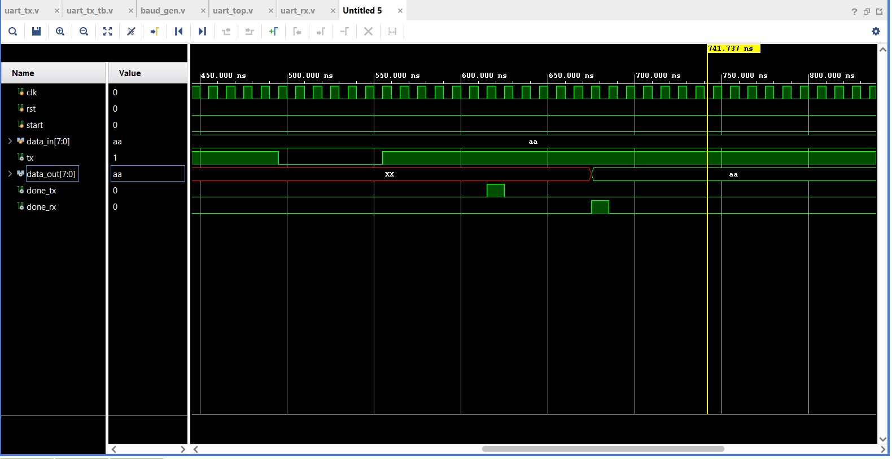

# UART Communication System using Verilog

## Overview
This project implements a complete UART communication system in Verilog, including a transmitter, a receiver, and a baud-rate generator. The design was simulated and verified using Xilinx Vivado.

## Features
- UART Transmitter (TX)
- UART Receiver (RX)
- Baud Rate Generator
- FSM-based design
- Loopback verification (TX → RX)

## Tools Used
- Verilog HDL
- Xilinx Vivado

## Results
The transmitted data was successfully received and verified through simulation.

Example:
Input:  10101010  
Output: 10101010  

## Project Structure
- src/: Design files
- tb/: Testbench
- screenshots/: Simulation results

## Author
MD Ziyaad Ul Hasan Ansari

## Simulation Output

